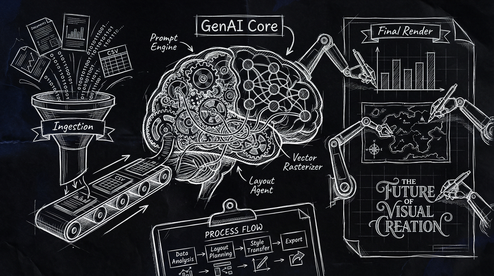

# InfoGraphix AI

> From raw ideas to publication-ready visuals in seconds: AI-powered deep research meets stunning 4K infographic generation. Feed it topics, URLs, or GitHub repos and watch Gemini's two-phase intelligence transform complex information into professionally designed, customizable visual content.

<p align="center">
  
</p>

[](CHANGELOG.md)
[](https://github.com/doublegate/InfoGraphix-GenAI/actions/workflows/ci.yml)
[](https://react.dev/)
[](https://www.typescriptlang.org/)
[](https://vitejs.dev/)
[](https://ai.google.dev/)
[](LICENSE)

---

## Overview

InfoGraphix AI is a powerful web application that generates high-quality infographic images from topics, URLs, or GitHub repositories. Powered by Google's Gemini AI, it combines sophisticated AI analysis with extensive customization options and productivity features.

**Core Pipeline:**

1. **Analysis Phase** - Gemini 3 Pro with thinking mode deeply researches your topic using Google Search grounding
2. **Generation Phase** - Nano Banana Pro creates stunning visual infographics in up to 4K resolution

**Productivity Features:**

- Batch process up to 50 topics in a single queue
- Save and reuse custom style templates
- Export in multiple formats (PNG, PDF, SVG, ZIP)
- Advanced version history with search and filtering

**Latest Updates (v2.0.3):**

- Batch Processing - Resolved network errors and optimized adaptive polling (5s -> 10s -> 30s)
- Bug Fixes - Fixed 6 application issues including batch processing, i18n, and UX improvements
- UI Polish - Updated filter button text and improved batch processing error handling
- Code Quality - Resolved 12 ESLint errors causing CI failures (no-console, react-hooks/exhaustive-deps)
- CI/CD - All workflows passing with improved lint compliance

---

## Features

### AI-Powered Generation

- **Deep Topic Analysis** - Leverages Gemini 3 Pro with 32K thinking budget for comprehensive research
- **Google Search Grounding** - Retrieves up-to-date information with source citations
- **Intelligent Visual Planning** - Automatically designs optimal infographic layouts
- **AI Design Suggestions** (v1.6.0) - Get 3 intelligent style and 3 palette recommendations based on your topic

### Customization Options

- **22 Artistic Styles** - Modern, Cyberpunk, Bauhaus, Art Deco, Watercolor, Blueprint, and more
- **10 Color Palettes** - Professional, Vibrant, Earth Tones, Ocean, Sunset, Monochrome, and others
- **Custom Palette Generator** (v1.6.0) - Extract colors from images with 5 color scheme algorithms
  - Complementary (opposite hue)
  - Triadic (120° spaced hues)
  - Analogous (adjacent hues)
  - Split-Complementary (base + 2 adjacent to complement)
  - Tetradic (double complementary)
- **55 Professional Templates** (v1.6.0) - Organized into 10 categories for easy discovery
  - Business & Professional (8 templates)
  - Technology & Innovation (7 templates)
  - Education & Learning (5 templates)
  - Creative & Artistic (7 templates)
  - Data & Analytics (6 templates)
  - Social Media (5 templates)
  - Marketing & Branding (5 templates)
  - Science & Research (4 templates)
  - Health & Wellness (3 templates)
  - Entertainment & Gaming (5 templates)
- **Multiple Resolutions** - 1K, 2K, or 4K output quality
- **Aspect Ratios** - Square (1:1), Landscape (16:9), Portrait (9:16), and standard formats

### Input Flexibility

- **Free-form Topics** - Enter any subject for AI research and visualization
- **URL Analysis** - Generate infographics from any web page or article
- **GitHub Repositories** - Visualize repository statistics and architecture
- **Custom Markdown** - Upload .md files for custom content analysis
- **GitHub Filters** - Filter by language, file extensions, or update date

### Productivity Features

- **Batch Generation** - Create up to 50 infographics in a single queue with progress tracking
- **Custom Templates** - Save and reuse your favorite style configurations (55 built-in templates)
- **Enhanced Version History** - Advanced search, filters, and pagination for saved generations
- **Export Formats** - Download as PNG, PDF, SVG, or multi-resolution ZIP
- **Keyboard Shortcuts** - 10 power user shortcuts for all common actions
- **Auto-Save Drafts** - Never lose your form input
- **Feedback System** - Rate and comment on generations

### Accessibility & Internationalization

- **WCAG 2.1 AA Compliance** - Full keyboard navigation and screen reader support
- **Multi-Language Support** - English and Spanish with automatic browser detection
- **RTL Language Support** - Automatic direction switching for Arabic, Hebrew, Persian, Urdu
- **High Contrast Mode** - Enhanced visibility with system preference detection
- **Screen Reader Announcements** - ARIA live regions for processing states
- **Skip Navigation** - Jump to main content with keyboard shortcut
- **WCAG Accessibility Checking** - Custom palettes automatically checked for AA/AAA contrast ratios
- **Locale-Aware Formatting** - Numbers, dates, and relative times formatted per user's locale

### Code Quality & Testing

- **Comprehensive Testing** - Vitest with React Testing Library, 70% coverage targets
- **TypeScript Strict Mode** - Full type safety across the entire codebase
- **ESLint Strict Rules** - Enforced code quality standards (no-explicit-any, no-unused-vars)
- **CI/CD Pipeline** - Automated testing, linting, security audits on every commit
- **Structured Logging** - Environment-aware debugging with performance timing
- **Rate Limiting** - Client-side API rate limiter with visual countdown
- **Error Tracking** - Integration ready for Sentry, LogRocket, or custom solutions
- **Bundle Analysis** - Track dependency size and optimize build output

---

## Quick Start

### Prerequisites

- **Node.js** 18 or higher
- **Google Gemini API Key** with billing enabled ([Get one here](https://aistudio.google.com/app/apikey))

### Installation

```bash
# Clone the repository
git clone https://github.com/doublegate/InfoGraphix-GenAI.git
cd InfoGraphix-GenAI

# Install dependencies
npm install

# Configure your API key
cp .env.local.example .env.local
# Edit .env.local and add your GEMINI_API_KEY

# Start the development server
npm run dev

# Optional: Run tests
npm test
```

Open [http://localhost:3000](http://localhost:3000) in your browser.

**Testing:**

```bash
npm test              # Run tests in watch mode
npm run test:ui       # Run tests with Vitest UI
npm run test:coverage # Generate coverage report
```

### Google AI Studio Deployment

This application is designed to run in [Google AI Studio](https://ai.google.dev/). When deployed there, API key selection is handled automatically via the `window.aistudio` interface.

---

## Usage

### Basic Generation

1. Enter a topic, URL, or GitHub repository name
2. (Optional) Click "Get AI Suggestions" for intelligent style and palette recommendations
3. Select your preferred artistic style (or apply AI-suggested style)
4. Choose a color palette (or use custom palette generator)
5. Set resolution and aspect ratio
6. Click "Generate Infographic"

### Advanced Options

**AI Design Suggestions (v1.6.0):**
Get intelligent recommendations based on your topic:

- 3 style suggestions with detailed reasoning
- 3 color palette suggestions with confidence scores
- Topic-aware analysis using Google Search grounding
- One-click application of suggestions

**Custom Palette Generator (v1.6.0):**
Create custom color schemes from images:

- Upload an image to extract dominant colors
- Choose from 5 color scheme algorithms
- Automatic WCAG accessibility checking (AA and AAA standards)
- Visual color swatches with hex codes
- Save custom palettes for reuse

**GitHub Repository Filters:**

| Filter | Description | Example |
|--------|-------------|---------|
| Language | Filter by programming language | `TypeScript`, `Python` |
| Extensions | Focus on specific file types | `.ts`, `.tsx`, `.py` |
| Updated After | Only include recent content | `2024-01-01` |

**Markdown Upload:**
Upload a `.md` file to use as the primary source material. The AI will analyze your content instead of performing web searches.

**Batch Generation:**
Create up to 50 infographics in a single queue. Enter multiple topics (one per line), configure shared settings, and let the system process them sequentially with progress tracking.

**Template Management:**
Save your favorite style configurations as reusable templates. The system includes 55 professional templates organized into 10 categories (Business, Technology, Education, Creative, Data, Social Media, Marketing, Science, Health, Entertainment), and you can create custom templates with names, descriptions, and tags.

**Export Options:**
Download generated infographics in multiple formats:

- PNG (default, lossless)
- PDF (with metadata)
- SVG (vector format)
- Multi-resolution ZIP (1K, 2K, 4K in one archive)

---

## Configuration

### Environment Variables

| Variable | Description | Required |
|----------|-------------|----------|
| `GEMINI_API_KEY` | Your Google Gemini API key | Yes |

See [.env.local.example](.env.local.example) for detailed configuration instructions.

### API Key Requirements

- Must be from a Google Cloud project with **billing enabled**
- Free tier: 2 requests/minute (limited)
- Paid tier: 60 requests/minute (recommended)

---

<p align="center">
  
</p>

---

## Architecture

```
InfoGraphix-GenAI/
├── src/                         # Source code directory
│   ├── App.tsx                  # Main application orchestrator (534KB main chunk)
│   ├── index.tsx                # React entry point
│   ├── types.ts                 # TypeScript enums and interfaces
│   ├── constants/               # Named constants and configuration
│   │   ├── api.ts               # API endpoints and rate limits
│   │   ├── storage.ts           # Storage thresholds and keys
│   │   ├── performance.ts       # Image compression and batch settings
│   │   ├── ui.ts                # Debounce timings and animations
│   │   ├── validation.ts        # Input validation rules
│   │   └── colors.ts            # Color extraction and WCAG constants
│   ├── services/
│   │   ├── geminiService.ts     # Gemini API integration
│   │   ├── batchService.ts      # Batch generation queue management
│   │   ├── templateService.ts   # Template CRUD operations (55 templates)
│   │   ├── storageService.ts    # IndexedDB abstraction with compression
│   │   ├── colorExtractionService.ts  # Color extraction and palette generation (565 lines)
│   │   └── errorTrackingService.ts    # Error tracking integration stub
│   ├── components/
│   │   ├── AboutModal.tsx       # Application information modal
│   │   ├── ApiKeySelector.tsx   # AI Studio key management
│   │   ├── ErrorBoundary.tsx    # Error handling wrapper
│   │   ├── FeedbackForm.tsx     # User feedback collection
│   │   ├── InfographicForm.tsx  # User input form (uses React Portal for modals)
│   │   ├── InfographicResult.tsx# Generated output display (dynamic import for exports)
│   │   ├── ProcessingState.tsx  # Loading indicators
│   │   ├── RichSelect.tsx       # Custom dropdown component
│   │   ├── VersionComparison.tsx# Version comparison view
│   │   ├── VersionHistory.tsx   # Saved generations browser (lazy-loaded, 26KB)
│   │   ├── StyleSuggestions.tsx # AI design suggestions UI (v1.6.0)
│   │   ├── PaletteGenerator.tsx # Custom palette generator (v1.6.0)
│   │   ├── BatchGeneration/     # Batch processing components
│   │   │   ├── BatchManager.tsx # Main batch management modal (lazy-loaded, 22KB)
│   │   │   ├── BatchQueueCreator.tsx # Queue creation interface
│   │   │   ├── BatchQueueList.tsx    # List of all batch queues
│   │   │   ├── BatchQueueCard.tsx    # Individual queue display
│   │   │   └── BatchItemCard.tsx     # Batch item status card
│   │   └── TemplateManager/     # Template management components
│   │       ├── TemplateBrowser.tsx   # Template selection modal (React Portal)
│   │       ├── TemplateGrid.tsx      # Grid view of templates
│   │       ├── TemplateCard.tsx      # Individual template card
│   │       └── TemplateEditor.tsx    # Template creation/editing
│   ├── contexts/                # React Context API providers
│   │   ├── GenerationContext.tsx # Generation state management
│   │   ├── ThemeContext.tsx     # Theme and accessibility state
│   │   └── index.ts             # Unified context exports
│   ├── utils/
│   │   ├── exportUtils.ts       # Export format utilities (lazy-loaded, 686KB)
│   │   ├── keyboardShortcuts.ts # Keyboard shortcut registry
│   │   ├── logger.ts            # Structured logging utility
│   │   ├── rateLimiter.ts       # Client-side API rate limiter
│   │   ├── storageHelpers.ts    # Type-safe storage utilities
│   │   └── validation.ts        # Input validation utilities
│   ├── hooks/
│   │   ├── useKeyboardShortcuts.ts # Keyboard shortcut event handling
│   │   ├── useAnnouncer.ts      # Screen reader announcements
│   │   ├── useHighContrast.ts   # High contrast mode management
│   │   ├── useStyleSuggestions.ts  # AI suggestions state management
│   │   ├── useGeneration.ts     # Generation workflow management
│   │   ├── useFormPersistence.ts # Form draft auto-save
│   │   ├── useVersionHistory.ts # Version history state
│   │   ├── useSavedVersions.ts  # IndexedDB version management
│   │   └── useModals.ts         # Modal visibility state
│   ├── theme/                   # Design system tokens
│   │   ├── tokens.ts            # Centralized design tokens (300+ variables)
│   │   └── index.ts             # Theme exports
│   ├── i18n/
│   │   ├── index.ts             # i18next configuration with RTL support
│   │   ├── en.json              # English translations
│   │   └── es.json              # Spanish translations
│   ├── test/                    # Testing infrastructure
│   │   ├── setup.ts             # Vitest setup and mocks
│   │   ├── testUtils.tsx        # Custom render utilities
│   │   └── mockData.ts          # Mock data fixtures
│   └── styles/
│       ├── main.css             # Global styles with accessibility utilities
│       └── high-contrast.css    # High contrast mode styles
├── vite.config.ts               # Build configuration with code splitting
└── docs/                        # All documentation and planning
    ├── technical/               # Technical documentation and architecture
    ├── guides/                  # User and developer guides
    └── planning/                # Sprint planning and roadmaps
```

### Technical Implementation

**Code Splitting & Lazy Loading:**

- Main application bundle: 533.72 kB (gzipped: 137.17 kB)
- Export libraries (jsPDF, JSZip): 686.49 kB (lazy-loaded on demand)
- BatchManager: 22.09 kB (lazy-loaded when accessed)
- VersionHistory: 26.10 kB (lazy-loaded when accessed)
- Dynamic imports for export utilities to reduce initial load time

**React Architecture:**

- Context API for state management (GenerationContext, ThemeContext)
- Custom hooks for complex state logic (useModals, useSavedVersions)
- React Portal for modals (TemplateBrowser)
- React.memo for performance optimization (12+ components)
- Error boundaries for graceful error handling

**State Management:**

- React Context API eliminates prop drilling
- IndexedDB for persistent storage (100MB+ capacity)
- Image compression (50-80% size reduction)
- Automatic quota management and cleanup
- Migration utilities from localStorage to IndexedDB

**Testing Infrastructure (v2.0.0):**

- Vitest testing framework with React Testing Library
- Test setup with comprehensive mocks (IndexedDB, localStorage, window.matchMedia)
- Custom render utilities with provider wrappers
- Mock data fixtures for all major types
- Coverage targets: 70% (current: ~15% foundation)
- Test categories: Unit, integration, accessibility

**Theme System (v2.0.0):**

- Centralized design tokens (300+ variables)
- Color palette: background, surface, border, text, interactive, semantic
- Spacing scale (xs to 4xl)
- Typography system: font families, sizes, weights, line heights
- Border radius, shadows, transitions, z-index scales
- Breakpoints for responsive design
- Helper functions for color manipulation

**Internationalization (v2.0.0):**

- RTL language support (Arabic, Hebrew, Persian, Urdu)
- Automatic document direction setting
- Number formatting with Intl.NumberFormat
- Date formatting with Intl.DateTimeFormat
- Relative time formatting with Intl.RelativeTimeFormat
- Pluralization support with i18next
- Missing key warnings in development

**Build Configuration:**

- Vite 7 with optimized chunk splitting
- 700KB chunk size warning limit for export libraries
- TypeScript strict mode enabled
- ESLint with strict rules (no-explicit-any, no-unused-vars)
- Bundle size analysis with rollup-plugin-visualizer

**Developer Experience:**

- Structured logging utility (environment-aware)
- Client-side rate limiter for API calls
- Type-safe storage helpers
- Form validation utilities
- Keyboard shortcut system (10 shortcuts)
- CI/CD pipeline with GitHub Actions (ESLint, TypeScript, Security, Build)

### AI Pipeline

```
User Input (Topic/URL/GitHub/Markdown)
    │
    ▼
┌─────────────────────────────────────┐
│     Phase 1: Topic Analysis         │
│  ┌───────────────────────────────┐  │
│  │  Gemini 3 Pro Preview         │  │
│  │  - Thinking Mode (32K budget) │  │
│  │  - Google Search Grounding    │  │
│  │  - JSON structured output     │  │
│  └───────────────────────────────┘  │
└─────────────────────────────────────┘
    │
    ▼
┌─────────────────────────────────────┐
│     Phase 2: Image Generation       │
│  ┌───────────────────────────────┐  │
│  │  Gemini 3 Pro Image Preview   │  │
│  │  (Nano Banana Pro)            │  │
│  │  - Visual plan execution      │  │
│  │  - 1K/2K/4K resolution        │  │
│  │  - Base64 PNG output          │  │
│  └───────────────────────────────┘  │
└─────────────────────────────────────┘
    │
    ▼
Generated Infographic (PNG)
```

**Optional: AI Design Suggestions (v1.6.0)**

```
User Topic Input
    │
    ▼
┌─────────────────────────────────────┐
│   AI Suggestion Analysis (Optional) │
│  ┌───────────────────────────────┐  │
│  │  Gemini 3 Pro Preview         │  │
│  │  - Topic categorization       │  │
│  │  - Google Search grounding    │  │
│  │  - 3 style suggestions        │  │
│  │  - 3 palette suggestions      │  │
│  └───────────────────────────────┘  │
└─────────────────────────────────────┘
    │
    ▼
User Applies Suggestions (one-click) or Chooses Manually
```

---

## Documentation

| Document | Description |
|----------|-------------|
| [User Guide](docs/guides/USER-GUIDE.md) | Complete step-by-step usage guide |
| [FAQ](docs/guides/FAQ.md) | Frequently asked questions and answers |
| [Architecture](docs/technical/ARCHITECTURE.md) | System design, data flow, state management |
| [API Reference](docs/guides/API.md) | Gemini integration, service interfaces |
| [Components](docs/guides/COMPONENTS.md) | React component documentation |
| [Deployment](docs/guides/DEPLOYMENT.md) | AI Studio, Vercel, Docker deployment guides |
| [Styling](docs/guides/STYLING.md) | TailwindCSS patterns, design system |
| [Troubleshooting](docs/guides/TROUBLESHOOTING.md) | Common issues and solutions |

---

## Roadmap

InfoGraphix AI follows a structured development roadmap with quarterly releases through Q3 2027.

### Version Timeline

| Version | Theme | Target | Key Features |
|---------|-------|--------|--------------|
| v1.3.0 | Foundation | 2025-12-11 | Core generation, 22 styles, 10 palettes, version history |
| v1.4.0 | Productivity Enhancement | 2025-12-11 | Batch generation, custom templates, SVG/PDF export |
| v1.5.0 | Accessibility & Global Reach | 2025-12-12 | Keyboard shortcuts, i18n (EN/ES), WCAG 2.1 AA, high contrast |
| v1.6.0 | AI Intelligence & Creativity | 2025-12-12 | AI design suggestions, custom palette generator, 55 templates |
| v1.7.0 | Technical Debt Remediation | 2025-12-12 | TypeScript strict mode, CI/CD, logger utility, ESLint |
| v1.8.0 | Architecture Improvements | 2025-12-12 | IndexedDB migration, Context API, performance optimizations |
| v1.9.0 | Code Quality | 2025-12-12 | Named constants, storage helpers, JSDoc, rate limiting |
| v2.0.0 | Testing & Advanced Features | 2025-12-12 | Vitest infrastructure, theme system, enhanced i18n |
| v2.0.1 | Bug Fixes | 2025-12-13 | Image rendering fix, storage hook migration |
| v2.0.2 | Documentation & Polish | 2025-12-13 | README images, docs reorganization, CI fixes |
| v2.0.3 | Stability & Quality | 2025-12-13 (Current) | Batch processing fixes, ESLint compliance, polling optimization |
| v2.1.0 | Expanded Test Coverage | Q1 2026 | 70% test coverage, integration tests, property-based tests |
| v2.2.0 | Platform & API | Q2 2026 | REST API, Python/JS SDKs, webhooks |
| v2.3.0 | Ecosystem Integrations | Q3 2026 | Google Workspace, Notion, Figma, Slack |
| v2.4.0 | Enterprise & Advanced | Q4 2026 | SSO/SAML, RBAC, admin dashboard |
| v3.0.0 | Stable Release | Q1 2027 | Performance optimization, UI/UX polish |

### Recent Updates

**v2.0.3 - Stability & Quality (2025-12-13):**

- Fixed batch processing network errors with robust retry and error recovery mechanisms
- Optimized adaptive polling intervals (5s -> 10s -> 30s) for reduced API load during queue processing
- Resolved 12 ESLint errors including no-console violations, react-hooks/exhaustive-deps warnings
- Fixed useCallback memoization for refreshQueues function in BatchManager component
- Wrapped async Promise-returning callbacks with void-returning wrappers to satisfy TypeScript
- Updated filter button text and improved batch processing error handling UX
- Fixed 6 application issues across batch processing, i18n, and general UX
- Removed debug console.log statements from geminiService for production compliance
- All CI workflows passing with full ESLint compliance

**v2.0.2 - Documentation & Polish (2025-12-13):**

- README enhancement with concept sketch and architecture blueprint images
- Fixed broken CI badge (corrected GitHub username in URL)
- Removed Table of Contents for cleaner document structure
- Documentation reorganization into technical/, guides/, and planning/ subdirectories
- 26 files reorganized with preserved git history
- 39 cross-references updated across codebase
- All CI/CD workflows passing

**v2.0.1 - Bug Fixes (2025-12-13):**

- Fixed image rendering bug in useImageErrorHandling hook (React state sync issue)
- Fixed history save functionality - migrated from deprecated localStorage hook to IndexedDB
- Resolved ESLint complexity warnings with targeted disable comments
- Fixed unused ESLint directive in test file
- All 26 tests passing, CI workflow green

**v2.0.0 - Testing & Advanced Features (2025-12-12):**

- Comprehensive testing infrastructure with Vitest and React Testing Library
- Test setup with comprehensive mocks for IndexedDB, localStorage, window.matchMedia
- Custom render utilities with provider wrappers for all contexts
- Mock data fixtures for all major types (templates, versions, batches)
- Coverage targets: 70% (current foundation: ~15%, 15 tests written)
- Theme system with 300+ centralized design tokens
- Enhanced i18n with RTL support (Arabic, Hebrew, Persian, Urdu)
- Number, date, and relative time formatting with Intl APIs
- Pluralization support with i18next
- Accessibility testing infrastructure with @axe-core/react
- Foundation for test-driven development workflow
- Sprint 4 completion: 3/6 tasks (50%), ~25 hours invested
- TypeScript strict mode, ESLint strict rules across codebase
- Structured logging utility for environment-aware debugging

**v1.9.0-1.9.1 - Code Quality Improvements (2025-12-12):**

- Named constants system (storage, performance, UI, validation, colors)
- Storage helper utilities (type-safe localStorage/IndexedDB operations)
- Comprehensive JSDoc documentation for all utilities and components
- Rate limiting system with client-side sliding window algorithm
- Rate limit indicator UI component with real-time countdown
- Styling conventions documentation (STYLING-CONVENTIONS.md)
- Magic numbers eliminated, DRY storage services
- Sprint 3 completion: 5/7 tasks (71%)

**v1.7.0-1.8.0 - Technical Debt & Architecture (2025-12-12):**

- React Context API for state management (GenerationContext, ThemeContext)
- IndexedDB migration with image compression (50-80% reduction)
- Custom hooks for complex state (useModals, useSavedVersions)
- React performance optimizations (memo, useMemo, useCallback)
- CI/CD pipeline with GitHub Actions (ESLint, TypeScript, Security, Build)
- Logger utility replacing 53 console statements
- Form validation utilities and image error handling
- Bundle size analysis with rollup-plugin-visualizer
- Sprint 1-2 completion: 21/21 tasks (100%)

**v1.6.0 - AI Intelligence & Creativity (2025-12-12):**

- AI-powered style and palette suggestions using Gemini 3 Pro with thinking mode
- Topic-aware analysis with Google Search grounding for context
- Three intelligent style recommendations with detailed reasoning
- Three color palette suggestions with confidence scores
- Custom palette generator with image upload and color extraction (Vibrant.js)
- Five color scheme algorithms: Complementary, Triadic, Analogous, Split-Complementary, Tetradic
- WCAG accessibility checking (AA and AAA standards) for custom palettes
- Expanded template library from 10 to 55 professional templates
- Category-based template organization (10 categories: Business, Technology, Education, Creative, Data, Social Media, Marketing, Science, Health, Entertainment)
- One-click application of AI recommendations
- Client-side color extraction for privacy (no server uploads)
- Custom palette persistence in localStorage
- New components: StyleSuggestions, PaletteGenerator
- New service: colorExtractionService.ts (445 lines of color theory algorithms)
- New hook: useStyleSuggestions for AI suggestion state management
- New dependency: node-vibrant@4.0.3 for color extraction

**v1.5.0 - Accessibility & Global Reach (2025-12-12):**

- Keyboard shortcuts system with 10 power user shortcuts (Ctrl+Enter to generate, Ctrl+S to save, Shift+? for help)
- Cross-platform keyboard support (Mac ⌘ vs Windows Ctrl detection)
- WCAG 2.1 AA accessibility compliance with comprehensive screen reader support
- Skip-to-content navigation link for keyboard users
- ARIA labels and live regions on all interactive elements
- Internationalization (i18n) with react-i18next integration
- English and Spanish language support with browser language detection
- Language selector component in navigation bar
- High contrast mode with system preference detection (prefers-contrast media query)
- Manual high contrast toggle with keyboard shortcut (Ctrl+Shift+C)
- Reduced motion support (prefers-reduced-motion media query)
- 200+ UI strings translated across all components
- New hooks: useKeyboardShortcuts, useAnnouncer, useHighContrast
- New components: KeyboardShortcutsModal, SkipLink, LanguageSelector
- Enhanced accessibility utilities in CSS (sr-only, focus-ring)

**v1.4.5 - Build Optimization & Bug Fixes (2025-12-11):**

- Fixed React Hooks violations in BatchManager, TemplateBrowser, and VersionHistory components
- Resolved "Rendered more hooks than during previous render" error
- Optimized production build with proper code splitting strategy
- Fixed TemplateBrowser modal rendering using React Portal for full-screen overlay
- Simplified Vite chunk splitting to prevent forwardRef errors
- Enhanced lazy loading: BatchManager (22KB), VersionHistory (26KB), export-libs (686KB)
- Build metrics: Main chunk 534KB, all lazy-loaded components load on demand

**v1.4.0 - Productivity Enhancement (2025-12-11):**

- Batch generation mode with queue management (up to 50 topics per batch)
- Custom template system with save/load/import/export (10 default templates, expanded to 55 in v1.6.0)
- Enhanced version history with advanced filtering and pagination
- Export to PNG, PDF, SVG, and multi-resolution ZIP formats
- Multi-URL analysis for comparative infographics
- New components: BatchManager, TemplateBrowser, and supporting modules
- New services: batchService.ts, templateService.ts, storageService.ts
- New utilities: exportUtils.ts for format conversion

### Upcoming Features by Theme

**v2.1.0 - Expanded Test Coverage (Q1 2026):**

- 70-80% test coverage across all services, hooks, and components
- Integration tests for multi-step workflows
- Property-based testing for edge cases
- Runtime validation with Zod for API responses
- Service worker for offline support

**v2.2.0 - Platform & API (Q2 2026):**

- REST API v1 with OpenAPI specification
- JavaScript/TypeScript and Python SDKs
- Webhook system with delivery tracking
- Developer portal with usage analytics

**v2.3.0 - Ecosystem Integrations (Q3 2026):**

- Google Workspace Add-on (Slides, Docs, Drive)
- Notion integration and Figma plugin
- Slack and Discord bots
- Zapier and Make automation support

**v2.4.0 - Enterprise & Advanced (Q4 2026):**

- SSO/SAML 2.0 authentication
- Advanced RBAC with custom roles
- Admin dashboard with organization analytics
- Brand guidelines enforcement system

**v3.0.0 - Stable Release (Q1 2027):**

- 50% improvement in generation speed
- Comprehensive monitoring and observability
- Complete UI/UX overhaul with design system
- Multi-language documentation (5 languages)

See [FEATURE-ROADMAP.md](docs/planning/FEATURE-ROADMAP.md) for complete details and [version-plans/](docs/planning/version-plans/) for sprint-level breakdowns.

**Development Resources:**

- [Technical Debt](docs/planning/TECHNICAL-DEBT.md) - Sprint-by-sprint technical debt tracking
- [Documentation Tasks](docs/planning/DOCUMENTATION-TASKS.md) - Documentation improvement tasks
- [Integration Ideas](docs/planning/INTEGRATION-IDEAS.md) - Future integration opportunities
- [STYLING-CONVENTIONS.md](docs/guides/STYLING-CONVENTIONS.md) - TailwindCSS styling guidelines
- [ERROR-TRACKING.md](docs/technical/ERROR-TRACKING.md) - Error tracking integration guide

---

## Scripts

| Command | Description |
|---------|-------------|
| `npm install` | Install dependencies |
| `npm run dev` | Start development server (port 3000) |
| `npm run build` | Build for production |
| `npm run build:analyze` | Build with bundle size analysis |
| `npm run preview` | Preview production build |
| `npm run lint` | Run ESLint checks |
| `npm run lint:fix` | Auto-fix ESLint issues |
| `npm test` | Run tests in watch mode |
| `npm run test:ui` | Run tests with Vitest UI |
| `npm run test:run` | Run tests once (CI mode) |
| `npm run test:coverage` | Generate test coverage report |

---

## Tech Stack

| Technology | Version | Purpose |
|------------|---------|---------|
| [React](https://react.dev/) | 19.2.3 | UI framework with hooks and portals |
| [TypeScript](https://www.typescriptlang.org/) | 5.9.3 | Type safety and development tooling |
| [Vite](https://vitejs.dev/) | 7.2.7 | Build tool with optimized code splitting |
| [TailwindCSS](https://tailwindcss.com/) | 4.1.18 (build-time) | Utility-first styling framework |
| [Lucide React](https://lucide.dev/) | 0.560.0 | Icon library |
| [@google/genai](https://www.npmjs.com/package/@google/genai) | 1.30.0 | Gemini API SDK for AI integration |
| [react-i18next](https://react.i18next.com/) | 16.4.1 | React integration for i18next |
| [i18next](https://www.i18next.com/) | 25.7.2 | Internationalization framework |
| [i18next-browser-languagedetector](https://github.com/i18next/i18next-browser-languageDetector) | 8.2.0 | Browser language detection plugin |
| [node-vibrant](https://www.npmjs.com/package/node-vibrant) | 4.0.3 | Color extraction from images |
| [jsPDF](https://www.npmjs.com/package/jspdf) | 3.0.4 | PDF generation (lazy-loaded) |
| [JSZip](https://www.npmjs.com/package/jszip) | 3.10.1 | ZIP archive creation (lazy-loaded) |
| [Vitest](https://vitest.dev/) | 4.0.15 | Testing framework with React Testing Library |
| [@testing-library/react](https://testing-library.com/react) | 16.3.0 | React component testing utilities |
| [@axe-core/react](https://github.com/dequelabs/axe-core-npm) | 4.11.0 | Accessibility testing |

---

## Contributing

Contributions are welcome! Please read our [Contributing Guide](CONTRIBUTING.md) for details on:

- Development environment setup
- Code style guidelines
- Commit message conventions
- Pull request process
- Issue reporting

---

## Security

InfoGraphix AI uses a **client-side architecture** with intentional design choices for Google AI Studio deployment. Please review our comprehensive [Security Policy](SECURITY.md) for details on:

- **API Key Security Model** - Why client-side API keys are used (AI Studio integration)
- **Data Handling** - What data stays in your browser vs. what is sent to Google
- **Production Considerations** - How to deploy securely outside AI Studio
- **Vulnerability Reporting** - Responsible disclosure process

**Quick Security Guidelines:**

- Never commit API keys to version control
- Use `.env.local` for local development (gitignored)
- Export important infographics regularly (localStorage has quota limits)
- For public production deployments, implement a backend proxy (see SECURITY.md)

**Reporting Vulnerabilities:** See [SECURITY.md](SECURITY.md#vulnerability-reporting) for responsible disclosure process.

---

## License

This project is licensed under the MIT License - see the [LICENSE](LICENSE) file for details.

---

## Changelog

See [CHANGELOG.md](CHANGELOG.md) for version history and release notes.

---

## Acknowledgments

- [Google Gemini](https://ai.google.dev/) - AI models powering analysis and generation
- [React Team](https://react.dev/) - UI framework
- [Vite](https://vitejs.dev/) - Build tooling
- [TailwindCSS](https://tailwindcss.com/) - Styling framework
- [Lucide](https://lucide.dev/) - Icon library
- [jsPDF](https://github.com/parallax/jsPDF) - PDF generation library
- [JSZip](https://stuk.github.io/jszip/) - ZIP file creation
- [node-vibrant](https://github.com/Vibrant-Colors/node-vibrant) - Color extraction library

---

<p align="center">
  <strong>InfoGraphix AI</strong> - Transform knowledge into visual stories
  <br>
  <a href="https://github.com/doublegate/InfoGraphix-GenAI">GitHub</a> |
  <a href="docs/technical/ARCHITECTURE.md">Docs</a> |
  <a href="docs/planning/FEATURE-ROADMAP.md">Roadmap</a>
</p>
