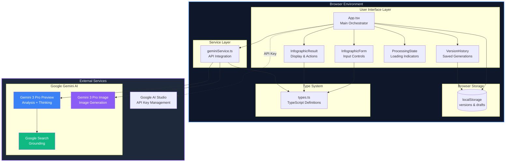
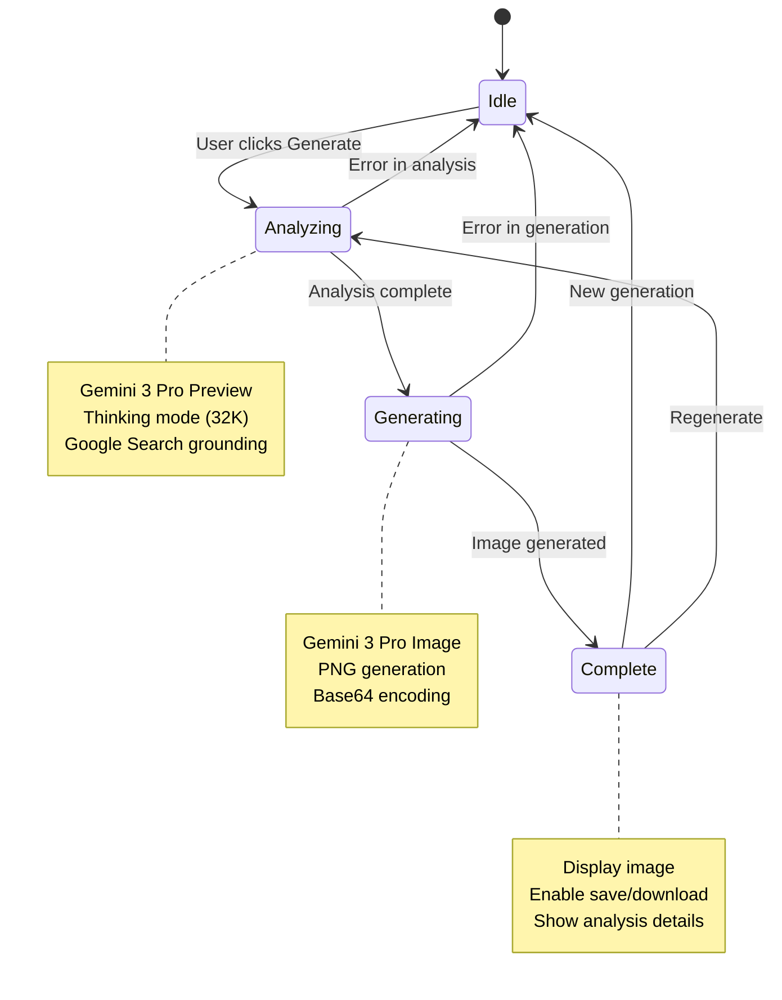
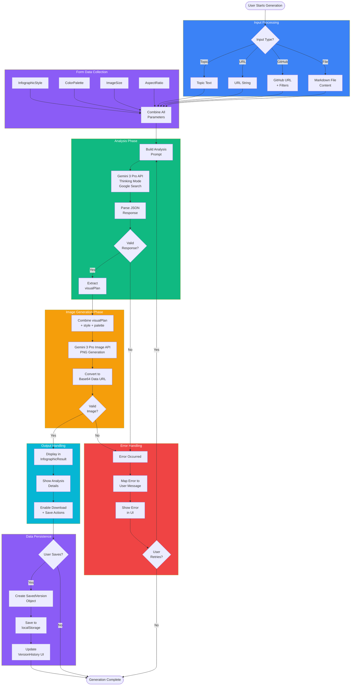
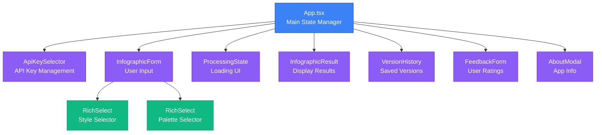
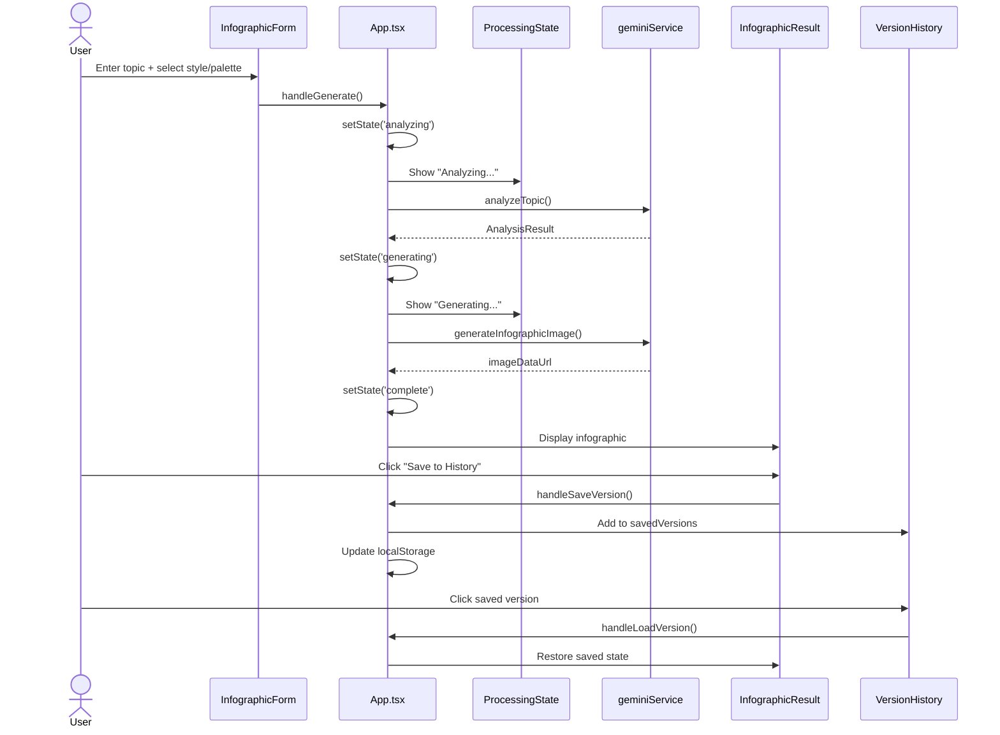

# Architecture

This document describes the technical architecture of InfoGraphix AI.

## System Overview

InfoGraphix AI is a client-side React application that interfaces with Google's Gemini AI APIs to generate infographic images. The application runs entirely in the browser with no backend server required.

### High-Level System Architecture



## Two-Phase AI Pipeline

### Phase 1: Topic Analysis

The analysis phase uses `gemini-3-pro-preview` with extended thinking capabilities.

**Configuration:**
- Model: `gemini-3-pro-preview`
- Thinking Budget: 32,768 tokens
- Google Search Grounding: Enabled (for current information)

**Input Processing:**
1. Topic text (direct input)
2. URL content (web page analysis)
3. GitHub repository (with optional filters)
4. Markdown file content

**Output Structure:**
```typescript
interface AnalysisResult {
  title: string;           // Infographic title
  summary: string;         // Brief topic summary
  keyPoints: string[];     // Main points to visualize
  visualPlan: string;      // Detailed image generation prompt
  webSources?: WebSource[];// Grounding sources (when available)
}
```

### Phase 2: Image Generation

The generation phase uses `gemini-3-pro-image-preview` (Nano Banana Pro).

**Configuration:**
- Model: `gemini-3-pro-image-preview`
- Response MIME Type: `image/png`

**Resolution Options:**
| Size | Dimensions (Landscape 16:9) |
|------|----------------------------|
| 1K   | 1024 x 576                 |
| 2K   | 2048 x 1152                |
| 4K   | 4096 x 2304                |

**Aspect Ratios:**
| Ratio | Name | Use Case |
|-------|------|----------|
| 1:1 | Square | Social media posts |
| 16:9 | Landscape | Presentations, wide displays |
| 9:16 | Portrait | Mobile, stories |
| 4:3 | Standard Landscape | Traditional documents |
| 3:4 | Standard Portrait | Print materials |

## State Management

All application state is managed in `src/App.tsx` using React hooks. No external state management library is used.

### State Architecture

```mermaid
graph LR
    subgraph AppState["App.tsx State"]
        subgraph GenerationFlow["Generation Flow State"]
            Step[processingStep<br/>idle→analyzing→generating→complete]
            Analysis[analysisResult<br/>AnalysisResult | null]
            Image[generatedImage<br/>string | null]
            Error[error<br/>string | null]
        end

        subgraph FormState["Form Input State"]
            Topic[topic: string]
            InputType[inputType: InputType]
            Style[selectedStyle: InfographicStyle]
            Palette[selectedPalette: ColorPalette]
            Size[imageSize: ImageSize]
            Ratio[aspectRatio: AspectRatio]
            Filters[githubFilters?: GithubFilters]
            FileContent[uploadedFileContent?: string]
        end

        subgraph PersistenceState["Persistence State"]
            Versions[savedVersions: SavedVersion<br>]
            CurrentFeedback[currentFeedback?: Feedback]
        end

        subgraph UIState["UI Control State"]
            ApiKeyReady[isApiKeyReady: boolean]
            Saved[isCurrentResultSaved: boolean]
            ShowHistory[showHistory: boolean]
            ShowAbout[showAbout: boolean]
            ShowFeedback[showFeedback: boolean]
        end
    end

    subgraph ExternalState["External State"]
        LocalStorage[(localStorage)]
        SessionState[Form Drafts<br/>Auto-save]
    end

    Versions <--> LocalStorage
    FormState <--> SessionState
    SessionState <--> LocalStorage

    classDef generation fill:#3b82f6,color:#fff
    classDef form fill:#8b5cf6,color:#fff
    classDef persistence fill:#10b981,color:#fff
    classDef ui fill:#f59e0b,color:#fff
    classDef external fill:#ef4444,color:#fff

    class GenerationFlow generation
    class FormState form
    class PersistenceState persistence
    class UIState ui
    class ExternalState external
```

### Processing Step State Machine



## Data Flow

### Complete Data Flow Diagram



### Generation Flow (Text-Based)

```
1. User Input
   │
   ├─► Topic Text
   ├─► URL
   ├─► GitHub Repo URL + Filters
   └─► Markdown File Upload
           │
           ▼
2. Analysis Phase (geminiService.analyzeTopic)
   │
   ├─► Construct analysis prompt
   ├─► Call Gemini 3 Pro with thinking mode
   ├─► Parse JSON response
   └─► Extract visualPlan for next phase
           │
           ▼
3. Generation Phase (geminiService.generateInfographicImage)
   │
   ├─► Combine visualPlan + style + palette + settings
   ├─► Call Gemini 3 Pro Image Preview
   └─► Receive base64-encoded PNG
           │
           ▼
4. Display & Storage
   │
   ├─► Display in InfographicResult component
   ├─► Enable download functionality
   └─► Optionally save to version history
```

### Persistence Flow

```
Form State ──────► localStorage (infographix_form_draft)
                   │
                   ├─► Auto-save on change
                   └─► Restore on page load

Saved Versions ──► localStorage (infographix_versions)
                   │
                   ├─► Save after successful generation
                   ├─► Load history on mount
                   └─► Delete individual versions
```

## Component Architecture

### Component Hierarchy



### Component Interaction Flow



## API Integration

### Google AI Studio Integration

When running in Google AI Studio:

```typescript
// Check for AI Studio environment
if (window.aistudio?.hasSelectedApiKey()) {
  // Use AI Studio's key management
} else {
  // Prompt user to select API key
  window.aistudio.openSelectKey();
}
```

### Local Development

For local development without AI Studio:

```typescript
// .env.local
GEMINI_API_KEY=your_api_key_here

// Usage
const apiKey = process.env.API_KEY;
```

### SDK Usage

```typescript
import { GoogleGenAI } from '@google/genai';

const ai = new GoogleGenAI({ apiKey });

// Analysis
const analysisResponse = await ai.models.generateContent({
  model: 'gemini-3-pro-preview',
  contents: [{ role: 'user', parts: [{ text: prompt }] }],
  config: {
    thinkingConfig: { thinkingBudget: 32768 },
    tools: [{ googleSearch: {} }]
  }
});

// Image Generation
const imageResponse = await ai.models.generateContent({
  model: 'gemini-3-pro-image-preview',
  contents: [{ role: 'user', parts: [{ text: imagePrompt }] }],
  config: {
    responseMimeType: 'image/png'
  }
});
```

## Error Handling

### API Error Mapping

| HTTP Code | Error Type | User Message |
|-----------|------------|--------------|
| 403 | Permission Denied | API key invalid or lacks permissions |
| 429 | Rate Limited | Too many requests, please wait |
| 503 | Service Unavailable | Gemini API temporarily unavailable |
| Other | Generic Error | Generation failed, please try again |

### Error Recovery

- Form state auto-saves to prevent data loss on errors
- Processing can be retried without re-entering data
- Version history persists independently of generation state

## Performance Considerations

### Image Storage

Generated images are stored as base64 data URLs. This can cause localStorage quota issues with many saved versions. Consider:

- Limiting saved version count
- Implementing image compression
- Using IndexedDB for larger storage needs

### API Latency

- Analysis phase: 5-15 seconds (depends on thinking complexity)
- Generation phase: 10-30 seconds (depends on resolution)
- Total typical generation: 15-45 seconds

### Bundle Size

- React 19: ~40KB gzipped
- @google/genai SDK: ~15KB gzipped
- Lucide icons: Tree-shaken, ~2KB per icon used
- TailwindCSS: CDN-loaded, not in bundle
