# API Documentation

This document covers the Gemini AI API integration and internal service interfaces.

## Gemini API Integration

### SDK Setup

```typescript
import { GoogleGenAI } from '@google/genai';

// Initialize with API key
const ai = new GoogleGenAI({ apiKey: 'YOUR_API_KEY' });
```

### Models Used

| Model | Purpose | Capabilities |
|-------|---------|--------------|
| `gemini-3-pro-preview` | Topic Analysis | Extended thinking, Google Search grounding |
| `gemini-3-pro-image-preview` | Image Generation | PNG output, multiple resolutions |

## Service Interface

### `geminiService.ts`

Location: `services/geminiService.ts`

#### `analyzeTopic()`

Analyzes a topic and generates a visual plan for the infographic.

```typescript
async function analyzeTopic(
  topic: string,
  inputType: InputType,
  options?: AnalysisOptions
): Promise<AnalysisResult>
```

**Parameters:**

| Parameter | Type | Description |
|-----------|------|-------------|
| `topic` | `string` | Topic text, URL, or GitHub repo URL |
| `inputType` | `InputType` | One of: `'topic'`, `'url'`, `'github'`, `'file'` |
| `options` | `AnalysisOptions` | Optional configuration |

**AnalysisOptions:**

```typescript
interface AnalysisOptions {
  // GitHub-specific filters
  githubFilters?: {
    language?: string;      // Filter by programming language
    extensions?: string[];  // Filter by file extensions
    dateRange?: {
      start?: Date;
      end?: Date;
    };
  };
  // File upload content
  fileContent?: string;     // Markdown file content
}
```

**Response:**

```typescript
interface AnalysisResult {
  title: string;
  summary: string;
  keyPoints: string[];
  visualPlan: string;
  webSources?: WebSource[];
}

interface WebSource {
  title: string;
  url: string;
  snippet?: string;
}
```

**Real-World Example:**

```typescript
// Example: Analyzing React documentation
const result = await analyzeTopic(
  'React 19 features and improvements',
  InfographicStyle.Modern,
  ColorPalette.BlueWhite
);

// Expected Response:
{
  title: "React 19: Revolutionary Features",
  summary: "React 19 introduces groundbreaking features including Actions, automatic batching improvements, and enhanced Server Components integration. The update focuses on performance, developer experience, and seamless transitions between client and server rendering.",
  keyPoints: [
    "Actions API for simplified data mutations",
    "Automatic memo() for component optimization",
    "Document metadata support in components",
    "Enhanced use() hook for async data",
    "Improved hydration error messages",
    "Asset loading optimization"
  ],
  visualPlan: "Create a modern, clean infographic with Professional Blue & White palette. Use a vertical layout with React logo at top. Show 6 feature cards in grid format (2x3), each with icon, title, and brief description. Include timeline showing evolution from React 18 to 19. Add performance comparison chart at bottom showing speed improvements. Use clean sans-serif typography with blue accent colors.",
  webSources: [
    {
      title: "React 19 Beta Documentation",
      uri: "https://react.dev/blog/2024/04/25/react-19"
    },
    {
      title: "What's New in React 19",
      uri: "https://vercel.com/blog/react-19"
    }
  ]
}
```

**GitHub Repository Example:**

```typescript
// Example: Analyzing Vite repository with filters
const result = await analyzeTopic(
  'https://github.com/vitejs/vite',
  InfographicStyle.Engineering,
  ColorPalette.DarkNeon,
  {
    language: 'TypeScript',
    fileExtensions: '.ts,.tsx',
    lastUpdatedAfter: '2024-01-01'
  }
);

// Expected Response:
{
  title: "Vite: Next Generation Frontend Tooling",
  summary: "Vite leverages native ES modules and modern browser capabilities to provide lightning-fast development server startup and hot module replacement. Built on esbuild and Rollup for optimal production builds.",
  keyPoints: [
    "Instant server start (<300ms typical)",
    "Lightning fast HMR regardless of app size",
    "Native ESM-based dev server",
    "Optimized build via Rollup",
    "Rich plugin ecosystem",
    "TypeScript support out-of-the-box"
  ],
  visualPlan: "Technical blueprint-style infographic with dark background and neon blue/green accents. Center: Vite logo with performance metrics radiating outward. Left side: development workflow diagram. Right side: build process flowchart. Bottom: comparison chart showing Vite vs traditional bundlers startup time. Use monospace fonts for code snippets and technical metrics.",
  webSources: [
    {
      title: "Vite Official Documentation",
      uri: "https://vitejs.dev"
    }
  ]
}
```

**Markdown File Upload Example:**

```typescript
// Example: Analyzing uploaded markdown content
const markdownContent = `
# Product Launch Plan
## Q1 2025 Goals
- Increase user base by 40%
- Launch mobile app
- Expand to 3 new markets
`;

const result = await analyzeTopic(
  'Product Launch Strategy',
  InfographicStyle.Corporate,
  ColorPalette.BlueWhite,
  undefined,
  markdownContent
);

// The AI will analyze the provided markdown instead of performing web searches
```

#### `generateInfographicImage()`

Generates an infographic image based on analysis results and style settings.

```typescript
async function generateInfographicImage(
  visualPlan: string,
  settings: GenerationSettings
): Promise<string>
```

**Parameters:**

| Parameter | Type | Description |
|-----------|------|-------------|
| `visualPlan` | `string` | Visual plan from analysis phase |
| `settings` | `GenerationSettings` | Style and output configuration |

**GenerationSettings:**

```typescript
interface GenerationSettings {
  style: InfographicStyle;
  palette: ColorPalette;
  size: ImageSize;
  aspectRatio: AspectRatio;
}
```

**Response:**

Returns a base64-encoded PNG image as a data URL string:
```
data:image/png;base64,iVBORw0KGgo...
```

**Real-World Example:**

```typescript
// Example: Generate 4K landscape infographic
const imageDataUrl = await generateInfographicImage(
  analysisResult.visualPlan,
  ImageSize.Resolution_4K,
  AspectRatio.Landscape
);

// Returns base64 data URL (truncated for readability):
// "data:image/png;base64,iVBORw0KGgoAAAANSUhEUgAAAA..."

// Use directly in img element


// Or download as file
const downloadImage = () => {
  const link = document.createElement('a');
  link.href = imageDataUrl;
  link.download = `infographic-${Date.now()}.png`;
  document.body.appendChild(link);
  link.click();
  document.body.removeChild(link);
};
```

**Resolution and Dimension Reference:**

| Size | Aspect Ratio | Dimensions | File Size (approx) | Use Case |
|------|--------------|------------|-------------------|----------|
| 1K | 16:9 Landscape | 1024 x 576 | 150-300 KB | Web thumbnails, quick preview |
| 1K | 1:1 Square | 1024 x 1024 | 200-400 KB | Social media posts |
| 2K | 16:9 Landscape | 2048 x 1152 | 600-1200 KB | Presentations, blog posts |
| 2K | 9:16 Portrait | 1152 x 2048 | 600-1200 KB | Mobile displays, stories |
| 4K | 16:9 Landscape | 4096 x 2304 | 2-4 MB | High-res prints, large displays |
| 4K | 1:1 Square | 4096 x 4096 | 3-5 MB | Print materials, high-quality posts |

## Type Definitions

### Enums

```typescript
// types.ts

enum InputType {
  Topic = 'topic',
  URL = 'url',
  GitHub = 'github',
  File = 'file'
}

enum ImageSize {
  Resolution_1K = '1K',
  Resolution_2K = '2K',
  Resolution_4K = '4K'
}

enum AspectRatio {
  Square = '1:1',
  Landscape = '16:9',
  Portrait = '9:16',
  StandardLandscape = '4:3',
  StandardPortrait = '3:4'
}

enum InfographicStyle {
  Modern = 'modern',
  Minimalist = 'minimalist',
  Corporate = 'corporate',
  Tech = 'tech',
  Nature = 'nature',
  Vintage = 'vintage',
  HandDrawn = 'hand-drawn',
  Geometric = 'geometric',
  Gradient = 'gradient',
  FlatDesign = 'flat-design',
  Isometric = 'isometric',
  Cyberpunk = 'cyberpunk',
  RetroFuturistic = 'retro-futuristic',
  Watercolor = 'watercolor',
  PaperCut = 'paper-cut',
  NeonGlow = 'neon-glow',
  Blueprint = 'blueprint',
  Chalkboard = 'chalkboard',
  Magazine = 'magazine',
  Bauhaus = 'bauhaus',
  ArtDeco = 'art-deco',
  DataViz = 'data-viz'
}

enum ColorPalette {
  Professional = 'professional',
  Vibrant = 'vibrant',
  EarthTones = 'earth-tones',
  Ocean = 'ocean',
  Sunset = 'sunset',
  Monochrome = 'monochrome',
  Pastel = 'pastel',
  BoldContrast = 'bold-contrast',
  Forest = 'forest',
  WarmNeutrals = 'warm-neutrals'
}
```

### Interfaces

```typescript
// Saved version for history
interface SavedVersion {
  id: string;
  timestamp: number;
  topic: string;
  inputType: InputType;
  style: InfographicStyle;
  palette: ColorPalette;
  size: ImageSize;
  aspectRatio: AspectRatio;
  analysisResult: AnalysisResult;
  imageDataUrl: string;
}

// Processing state
type ProcessingStep = 'idle' | 'analyzing' | 'generating' | 'complete';
```

## Error Handling

### Error Response Format

All API errors are thrown as JavaScript Error objects with descriptive messages. The service includes centralized error handling that maps Gemini API errors to user-friendly messages.

```typescript
// Error structure (thrown from geminiService.ts)
interface ApiError extends Error {
  message: string;  // User-friendly error description
  // Original error details available in console logs
}
```

### Error Codes and Messages

| HTTP Code | Error Pattern | User Message | Recovery Steps |
|-----------|---------------|--------------|----------------|
| 403 | `permission_denied` | "Permission denied. Please ensure you have selected a valid API Key for the paid tier project." | 1. Verify API key is valid<br>2. Ensure billing is enabled on Google Cloud project<br>3. Check API key has Gemini API access |
| 429 | `resource_exhausted` | "Rate limit exceeded. We're getting too many requests. Please wait a moment and try again." | 1. Wait 60 seconds before retry<br>2. Implement exponential backoff<br>3. Consider upgrading to paid tier |
| 503 | `unavailable` or `overloaded` | "The Gemini service is currently overloaded. Please try again in a few seconds." | 1. Wait 10-30 seconds<br>2. Retry request<br>3. Check [Google Cloud Status](https://status.cloud.google.com/) |
| 400 | `invalid_argument` | "The request parameters were invalid. Please check your inputs." | 1. Verify topic is not empty<br>2. Check filters are valid<br>3. Ensure style/palette enums are correct |
| N/A | `safety` or `blocked` | "The request was blocked due to safety settings. Please try a different topic or phrasing." | 1. Rephrase topic to avoid sensitive content<br>2. Try a different angle<br>3. Remove potentially harmful keywords |
| N/A | `candidate` | "The model could not generate a valid response for this prompt. Please try again." | 1. Retry the same request<br>2. Simplify the topic<br>3. Try a different style/palette combination |

### Real-World Error Examples

**Example 1: Permission Denied (403)**

```typescript
try {
  const result = await analyzeTopic(
    'AI trends in 2025',
    InfographicStyle.Modern,
    ColorPalette.BlueWhite
  );
} catch (error) {
  console.error(error.message);
  // "Permission denied. Please ensure you have selected a valid API Key for the paid tier project."

  // Handle in UI:
  setError(error.message);
  // Show link to API key setup instructions
  // Prompt user to verify billing is enabled
}
```

**Example 2: Rate Limit Exceeded (429)**

```typescript
try {
  const result = await analyzeTopic(topic, style, palette);
} catch (error) {
  console.error(error.message);
  // "Rate limit exceeded. We're getting too many requests. Please wait a moment and try again."

  // Implement retry with exponential backoff:
  const retryWithBackoff = async (attempt = 0) => {
    const delay = Math.min(1000 * Math.pow(2, attempt), 30000); // Max 30s
    await new Promise(resolve => setTimeout(resolve, delay));

    try {
      return await analyzeTopic(topic, style, palette);
    } catch (retryError) {
      if (attempt < 3) {
        return retryWithBackoff(attempt + 1);
      }
      throw retryError;
    }
  };

  result = await retryWithBackoff();
}
```

**Example 3: Service Unavailable (503)**

```typescript
try {
  const imageUrl = await generateInfographicImage(visualPlan, size, ratio);
} catch (error) {
  console.error(error.message);
  // "The Gemini service is currently overloaded. Please try again in a few seconds."

  // Show retry button in UI:
  setError({
    message: error.message,
    canRetry: true,
    retryDelay: 10000 // Suggest 10 second wait
  });
}
```

**Example 4: Safety Filter Triggered**

```typescript
try {
  const result = await analyzeTopic(
    'sensitive political topic',
    InfographicStyle.Modern,
    ColorPalette.BlueWhite
  );
} catch (error) {
  console.error(error.message);
  // "The request was blocked due to safety settings. Please try a different topic or phrasing."

  // Suggest rephrasing:
  setSuggestion("Try focusing on factual, neutral aspects of the topic");
}
```

### Comprehensive Error Handler

```typescript
const handleApiError = (error: Error) => {
  const message = error.message.toLowerCase();

  // Map error to user action
  if (message.includes('permission') || message.includes('403')) {
    return {
      type: 'permission_error',
      title: 'API Key Issue',
      message: error.message,
      actions: [
        { label: 'Check API Key', link: 'https://aistudio.google.com/app/apikey' },
        { label: 'Enable Billing', link: 'https://console.cloud.google.com/billing' }
      ]
    };
  }

  if (message.includes('rate limit') || message.includes('429')) {
    return {
      type: 'rate_limit',
      title: 'Too Many Requests',
      message: error.message,
      retryAfter: 60, // seconds
      actions: [
        { label: 'Wait and Retry', action: 'retry' }
      ]
    };
  }

  if (message.includes('unavailable') || message.includes('503')) {
    return {
      type: 'service_unavailable',
      title: 'Service Temporarily Unavailable',
      message: error.message,
      retryAfter: 10,
      actions: [
        { label: 'Retry Now', action: 'retry' },
        { label: 'Check Status', link: 'https://status.cloud.google.com/' }
      ]
    };
  }

  // Generic error
  return {
    type: 'unknown',
    title: 'Generation Failed',
    message: error.message,
    actions: [
      { label: 'Try Again', action: 'retry' }
    ]
  };
};
```

## Google AI Studio API

When running in Google AI Studio, the application uses the `window.aistudio` interface.

### Interface Definition

```typescript
interface AIStudioAPI {
  hasSelectedApiKey(): boolean;
  openSelectKey(): void;
}

declare global {
  interface Window {
    aistudio?: AIStudioAPI;
  }
}
```

### Usage

```typescript
// Check if running in AI Studio
const inAIStudio = typeof window.aistudio !== 'undefined';

// Check if API key is selected
if (window.aistudio?.hasSelectedApiKey()) {
  // Proceed with API calls
} else {
  // Prompt user to select key
  window.aistudio?.openSelectKey();
}
```

## API Flow Diagrams

### Complete Generation Sequence

```mermaid
sequenceDiagram
    participant User
    participant App as App.tsx
    participant Form as InfographicForm
    participant Service as geminiService
    participant Gemini3Pro as Gemini 3 Pro<br/>(Analysis)
    participant GeminiImage as Gemini 3 Pro Image<br/>(Generation)
    participant Storage as localStorage

    User->>Form: Enter topic, select style/palette
    Form->>App: handleGenerate(topic, style, palette, ...)
    App->>App: setProcessingStep('analyzing')
    App->>Service: analyzeTopic(topic, style, palette)

    Service->>Gemini3Pro: POST /generateContent<br/>{model: "gemini-3-pro-preview",<br/>thinkingBudget: 32768,<br/>tools: [{googleSearch}]}

    Note over Gemini3Pro: Deep analysis with<br/>thinking mode + Google Search

    Gemini3Pro-->>Service: JSON{title, summary,<br/>keyPoints, visualPlan,<br/>webSources}
    Service-->>App: AnalysisResult

    App->>App: setProcessingStep('generating')
    App->>Service: generateInfographicImage(visualPlan, size, ratio)

    Service->>GeminiImage: POST /generateContent<br/>{model: "gemini-3-pro-image-preview",<br/>imageConfig: {size, aspectRatio}}

    Note over GeminiImage: Generate PNG image<br/>based on visual plan

    GeminiImage-->>Service: base64 image data
    Service-->>App: imageDataUrl (data:image/png;base64,...)

    App->>App: setProcessingStep('complete')
    App->>User: Display generated infographic

    opt Save to History
        User->>App: Click "Save to History"
        App->>Storage: localStorage.setItem('infographix_versions')
        Storage-->>App: Saved
    end

    opt Download
        User->>App: Click "Download"
        App->>User: Download PNG file
    end
```

### Authentication Flow (Google AI Studio)

```mermaid
sequenceDiagram
    participant User
    participant App as App.tsx
    participant Selector as ApiKeySelector
    participant AIStudio as window.aistudio
    participant Service as geminiService

    App->>AIStudio: Check hasSelectedApiKey()

    alt API Key Not Selected
        AIStudio-->>App: false
        App->>Selector: Show modal (isOpen=true)
        Selector->>User: Display "Select API Key" button
        User->>Selector: Click button
        Selector->>AIStudio: openSelectKey()
        AIStudio->>User: Show AI Studio key selector
        User->>AIStudio: Select API key
        AIStudio-->>Selector: Key selected
        Selector->>App: onReady()
        App->>App: setIsApiKeyReady(true)
    else API Key Already Selected
        AIStudio-->>App: true
        App->>App: setIsApiKeyReady(true)
    end

    Note over App,Service: Ready for API calls

    User->>App: Start generation
    App->>Service: analyzeTopic(...)
    Service->>Service: getAI() → new GoogleGenAI({apiKey})

    alt Valid API Key
        Service->>Service: Make API call
        Service-->>App: Success response
    else Invalid/Missing API Key
        Service-->>App: Error: "API Key not found"
        App->>Selector: Show API key error
    end
```



### Error Recovery Flow


### Version History Persistence Flow


## Rate Limits and Quotas

### Gemini API Limits

| Tier | Requests/Minute | Tokens/Minute |
|------|-----------------|---------------|
| Free | 2 | 32,000 |
| Pay-as-you-go | 60 | 1,000,000 |

### Best Practices

1. **Implement request queuing** - Don't fire multiple requests simultaneously
2. **Cache analysis results** - Reuse analysis for regeneration with different styles
3. **Show progress indicators** - Generation takes 15-45 seconds typically
4. **Handle errors gracefully** - Provide clear user feedback on failures
